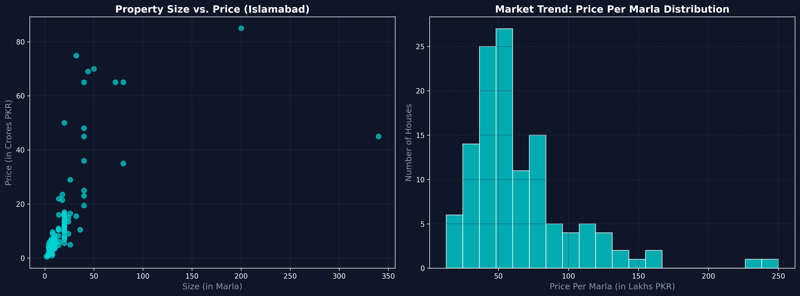

# 🏙️ Real Estate Data Pipeline & Market Analysis (Python)

## 📌 Project Overview
Instead of using a pre-cleaned Kaggle dataset, I built a custom **Data Engineering Pipeline** to scrape, clean, and analyze live real estate data. The goal of this project was to extract raw property listings from the internet, transform unstructured text into mathematical formats, and perform Exploratory Data Analysis (EDA) to find market trends in Islamabad.

### 🛠️ Tech Stack Used
* **Data Extraction (Web Scraping):** Python, `requests`, `BeautifulSoup`
* **Data Transformation (ETL):** `Pandas` (String parsing, Unit conversions, Handling Nulls & Infinity values)
* **Exploratory Data Analysis (EDA):** `Matplotlib` (Custom dark-theme visualizations)

---

## 📊 Market Insights Dashboard
*(Visualized using Matplotlib)*

---

## 💡 Key Market Insights Derived
1. **Price Distribution (The "Average" Cost):** The histogram reveals a right-skewed distribution. The majority of the properties in the analyzed sector hover between **4M to 8M PKR per Marla**.
2. **Size vs. Value Dynamics:** The scatter plot shows a clear positive correlation between property size and total price, but also identifies extreme market outliers (e.g., a massive 200-Marla estate priced near 900M PKR).
3. **Feature Engineering:** Raw scraped data (`"PKR 12.5 Crore"`, `"1 Kanal"`) was programmatically converted into unified numeric units (`125,000,000 PKR`, `20 Marla`) to create a new KPI: **Price_per_Marla**, allowing for standardized comparison across all properties.
